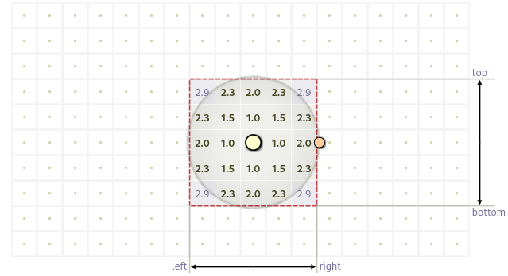
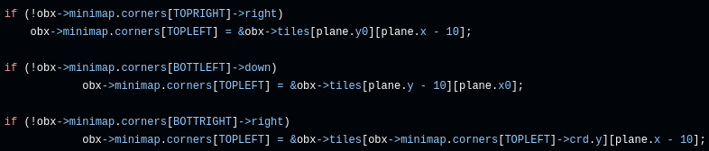

# **Dynamic Minimap**

**Dearest Readers,** (if you know, you know 😂)

This project is about creating a **dynamic minimap 😎** for a 2D game. If you’ve ever played a game with a huge map, you know how annoying it can be when the minimap is just as massive, cluttered, and hard to read. That’s where this comes in\! The dynamic minimap focuses on the player’s immediate area, making it way more useful and less overwhelming.

## **Why Bother with a Dynamic Minimap?**

Let’s be real \- nobody wants to stare at a giant minimap that shows the entire world. It’s messy, distracting, and honestly, not that helpful. A dynamic minimap fixes this by:

1. **Staying Focused on the Player**: It only shows what’s around the player, so you’re not bombarded with unnecessary info.

2. **Keeping Things Clean**: By rendering just a small area, the minimap stays compact and easy to read.

3. **Boosting Performance**: Rendering less stuff means better performance, which is always a win, especially for bigger games.

4. **Making Life Easier for Players**: A smaller, smarter minimap helps players navigate without feeling lost or overwhelmed.

## **Preliminaries 😭**

Before diving into the main algorithm, I had to make sure the map file passed as an argument was valid and followed these rules:

1. The map file needs to have a .obx extension.

2. The map must be composed of only 4 possible characters:  
* **0** for an empty space,  
* **1** for a wall,  
* **‘ ’** (space) which I interpreted as… something 🤷🏿‍♂️,  
* **S** for the player’s starting position.

3. The map must be closed/surrounded by walls.

4. There cannot be empty lines on the file.

This whole process is handled in the checks and family functions. Since it’s not the focus of this repo, I won’t go into depth here. However, feel free to check out the source code yourself—I’m sure you’ll understand it because the function and variable names are self-explanatory, and the algorithm is straightforward.

After ensuring the map was valid, I converted it into a tile map, where each tile represents one character from the original map. This is done in two main functions:

* **link\_tiles**: Responsible for linking the tile pointers to create a connected map.

* **set\_tiles**: Assigns each tile an identification (character ID, color, and coordinates) based on the character it represents from the original map.

It’s also worth mentioning that I check the size of the map to decide whether to apply the dynamic minimap algorithm or not. If the map size is at least 11x11, I apply the algorithm; otherwise, I just render the entire minimap. This is because my minimap is made up of exactly 121 tiles (11x11).

## **How It Works**

So, how does this magic happen? Here’s the breakdown:

1. **Player’s Position is Key**:

I based my algorithm on an idea from [Circle fill on a grid](https://www.redblobgames.com/grids/circle-drawing/) called **Bounding Box,** which involves finding the corners of the minimap based on the player’s current position.

  <figure>
    
    <figcaption>
      Bounding Box Illustration Image from <a href="https://www.redblobgames.com/grids/circle-drawing/">Circle fill on a grid</a>
    </figcaption>
  </figure>

This is done in the update\_obx function, where I set a square radius of 5 tiles in the cardinal directions starting from the player’s position to get the corner tiles. After finding them, I use the top-left corner as a reference to help with the logic of the algorithm and to paint the minimap later.

2. **Fixing Inconsistencies:**

At this point, the algorithm was working, but it showed some inconsistencies when one of the other three minimap corner tiles pointed to a surrounding tile of the “big map.” To solve this, I had to adjust the reference tile in these three cases by adding these 3 specific conditions:  

  <figure>
    
    <figcaption>
      Bounding Box Illustration Image from Bounding_Box/src/OBX/update_obx.c
    </figcaption>
  </figure>

Image from the code source: Dynamic\_Minimap/src/OBX/update\_obx.c  
	Without these conditions, I was either getting a segmentation fault or a bounding box smaller than the minimap size, which led to some tiles of the minimap being static. Shoutout to **@gecarval 🫱🏿‍🫲🏻** for suggesting I clear the image (by painting it all black) each time the player moved. While this helped, it wasn’t the full solution because even though the static tiles weren’t being rendered, the minimap still wasn’t being completely painted.

3. **Real-Time Updates:**

	Finally, after squashing a bunch of bugs, the algorithm became fully functional. Now, as the player moves, the minimap updates instantly, keeping everything accurate.

## **How to Use It**

1. Clone this repo.  
2. Drop the minimap system into your 2D game engine.  
3. Set up the render radius and customize the icons to match your game’s style.  
4. Make sure the player’s position updates in real-time, and you’re good to go\!

## **Wanna Help Out?**

If you’ve got ideas for making this even better, feel free to open an issue or submit a pull request. Let’s make this minimap the best it can be\! 🚀

**Thanks for reading\!** 👨🏿‍💻❤️

**Yours Truly,** (again, if you know, you know 🤣)  
Efinda 🫠
jJkqcwiyx0pDkK+I6D5YpNIq38XgKuepv+nEYnL2ngJeC89g0hOWrjWRYpM17+wsqP881VyCe+4KGp3Lyntc4JhF/1tlEuO8SOuSzHbjF0AYtDZ35ZD0QQLThyjWbu/Zqm77nIXjJ4xCQPBIdzHyFhZajb7C18TflKVbXs8Qk4LI9YfzJWrA2kjCEFHAJuIItdWU4uAWfOc2vYc5JtvfN4glPAwaOK5wbCyta0rcMwMJ4jhC2W5x78gXIX8b2cRC1/lcuG8znivuM/xFrN9oNixdpSqhTRPfZ+HKTi1ZrxccxnZqbBrhd2U7/+A202RVEU5d7mHxFwKdNktC0ffM3nGQOp02Wm9Jmyc9oUcGfPvUnNmrfi9IxZc+jpZ56lTz/7zLYfDENBGJhDi/W6jObhQwwPYm4bbP5ElmyTHAIONjkvCE3Jj84Z3jqkR288R6Vq+67Ri87TnuahXKRxrdnzl+S0KfrgnYGAQRoCDjj34yXgMOTrFCMChvKcNgH3Ah4nWU5IwGF4VoaQce2S77GJT9pEY3IJuKTwwMFrhnIG8HIAGz6SgJgd8uQh9pRKXnhAC1dqwOmxW97mcmA+R4APNPC/bueR1Gp4DAv6LtOf5XKFFw4VcIqiKIqTZBNwPXv18/wCFZQrb5/0jyFUDLkiPWz4KMsuAq5IsdJ048YNyhaShypVrs7CDSIP8+tSpc3k2r9Jy2HRPFxn2vyJLFmfHAKuXhffdeHjCAznSn50zvC8wKOFrzQx1Crrjp84SZMmT7OWIe4w9AYhiOFRCBLYMeyaq7Dv/kEESP7ECLgWQ+ZT15mbeJgTw6mmmHMKOAgXeIcwFArvW2IEHOboieCCp8n8iCG0RGVru7tZwHnRfc5W2/kLEGIQp4Uq1ufhapSNMnXb8nOECMf9btJ3OuctUSPCupfD1h7jsgGxmJCAO3nqNLVu28F1bEVRFOXexSXgulWryR8p4COGy/MXcLpVeEVelxgBhzltmAPn9dWi82dE8BEDPnjARwwYKhX7zz9f548bMOdN5rtdeP8DerRRMyvPwkW+uUGJwZ/IgjiQjxgwpAjxh/X+BJx8xLD07J+chvjyt28IFXho8PEBhsUwZIj12L5Rr8k8N0xsAj7gmLdgoc3WoPt49upg+FI8bQAfQcCOie5iS4yAw7AgPEMQo/CEPZg6zkvqFHAAHiRMwsc1iQcR+BNwuKcAYkbmcPHPiMSKVvyMCIYOzf0nRsAtO/c//AwAPsqQY4oNYF5icgo4f+Ar6JHPnOZ995y/g4fyYYdok48YIIR9eYtZwhPzG8Uzl5CAwxy4vPl9X/YqiqIo9wcuAZeUdOnag78addqVOJydc7DjFHD3Arcj4JIb/RkRRVGU+5NkFXBg3/44j5ri5l4UcOYP+TrXBxNJ/UO+ycGo0fYPWBRFUZT7g2QXcIqiKIqiKErSogJOURRFURQlyFABpyiKoiiKEmSogFMURVEURQkyVMApiqIoiqIEGSrgFEVRFEVRggwVcLfBps1bXbY7gVdsUn8gAkLm3IVc9vuVTp270h9//ME/D4Jl+dFfJ1iHyBf4oV38ADFCWpn5YcOPHsuPL3tFhAD4MV5zv/iRZPzQs2mTSB7OvAA/PNyjZ18+X8T/PfPGWdcxbofchcP5h4YRo7fjpDWu9U4kTnFygEggOQuWc9mBM6YvftB54bHrLntikZ+9Segnb/DD5D/8cJl+++0317pgBT96LT8WLTzafULsvf2e5h+6wvGbxY4fVP/zzz+pSbMWtvz4sfHLl3+06pM/zPu3ZNkK1/o7iXmNHSc9ZdnlZ4OcP56uKHcrKuBug9sVcIh5GVaulsueEGas14RAI2xGVbib8YrakRgQlsppcwIB9/Irr7rswIzEkDl3QY4SUalZN0qTKYSGrvH9ILUIOJwrQoChEyhYvm68As4puCHgEFLMmVdwRpsQEIEkqQUcRFPx6hGcRvgu53ontyvgilZpzNEpnHaAWLH+BJzXNo37TEsSAZeYH56ePMUX9izYwYvd3Ncu2wRc4UqP0vQ9F/llBeW8zuMjbNucOHnKU8AhvKFz//7A/funBZx5jV71UAWcEiyogAuAjFlCaMPGzdxYTZg4xbLv2LmLXty9h7777ns6dNjXEEyfOZs2b9nG6WnTZ9HWbc+59ifkCCtNw58+wZjiJeThstRv8R4at+3fVKfTcCs+ZuqMIVb4LnM/eYtXooiBs7kxQngmsQ9a9RrnNz1w8Bgh/FWnKevYG4TGDHaEAUMYrqkvfUoVmnSx8iO2ave522jYuuM05KnDHBLMPLaTcVvfpZl7v2aPjsQGRaeMc4M3q2TNuA4AHQbCdE3b8xmLpSot+/DxENILIchGrD9li2M7fvt7fH04T7kmnBP22WPec3zukheeJcQbnbjjPIswsQcq4BC7duSzZ6zlZWf/YhHhjLPaZfoz1LT/zKAVcIjhiri32UKL0+RdH1j24iXL0ZGjx9jz0jSipWUfOWos14Nvv/2OogYM5nKLaCt9+w3g9a8fOkz9o+xh0UzEq4ky5VyHewxRgevHfYUN5QPL0cd+duX3EnCNek/h60DItofSxMVJnhBbDlAeuFwWj4vF7CXg0IHvfXU/vfnW27Rm3XrbOqeAQySMi198QV9++ZXlxUOs53f//R7NnD2X72G9Bo2t/EWLl6GPP/mE3nr7Hapd91Hbvmz7TZmeZu+7ZC0j3Fr00WuufLcKyjbquSng2o1dwfdUllHnzW0CFXAIgYiQiAiPOGDgENs6p4DD/VvxxGrb/QPr1j/DL8inTp+hs+fizjGiRWu+f9h/aAH/Iwsol2gbqreN4uXBq1+3vOXmNZau28a1rVPAoc3AX+p0vhCAinK3oAIuAD6/eJFq1PLFgJ0zbwEtWuLrNNA4S55mzVtZaQwXIK6r2fElBILRQ7A0GzArLo7q7C1UuUUvFnpmXrMDArmL+ALZczpWuDj3bQo4ieM669VvKEveIlYDhw5DYnIuOX3TEk61Ow6ztoWnxjnkYlIporuVhjcMb/l400UQd+wfdlwjgrkjjVioEHHmPnA8iFdZjpyxwbdvQ4ThPJec+YPTrYYt5Iba3AeAoMI9ddoDFXC4961HxHUoEI7lHn0szgMXe33wJkFY4J7HJ+BwrhILFnFj7yYBB4ErcXzFli+sMA8zP5TK98zQibZs3Y7Tdes3svKZHStiFaOe5MkXJ7gTAuIMcXBxH7GM8/DngYOgdtqcAq7T5LVW54x4w3gxsvL2nkoZc4a59uEl4EyRhvrubx0wX7wgKjpHdqfSZSvYond89dXX/B/3BsOQYj956rRtX05CwspYw5i9o3dR5eY9XXluhyKPNLTVZ3iZUTcxrAiBh5cqM3+gAu7KlatWGmWnecs4keQUcLh/6TP5YjrL/UP6pT2vWHkGDfa1QVj32uuHOJ0mfRb666+/KGWa+EcXqrXuzy925ougeY1enl2ngFOUuxUVcAFw48YNKlLMJ6LggZCh0+3P7bTyVKsRF9Ad7H7pZdeQIDxnwKuDHrBiP3sJ0KhaAm7WZqrYJNIVais+AefVAXoJOHjJMoYUsJYxHIhzgHcOnhDZxhRwGO41vVxOEIDeaUMAeohFWYY4k2MiqD1Enpkfx8N1y7Kk0YHDWyhg6BL2FkMXuLwwIFWGHFZeCCaxByrg0MDDSynLEBqFKtSzzYGDJ6lC4868Pj4B5+WBM+e54b6b673KB0gOAQdBWa/LaOowfhV74WBDhwwPm+RBZ9qnbxSnS5SKe0FAhyvpFKkz8Bwic99No2ZaZR4CxFz3YKoMXN7hTZX5hbcr4Pos2s3HwjOf8cqX7A2WdRDkKDMo3/lKVbXsXgLO9BqNnzDZts4p4HLmyU/n3nyLnws8T5HderKAM+eESTq8QmX6+++/2dsEfvzxJ9u+vChRI4LL8tyDP/ALj3O9CV6w/LUvXjgFXNTyV7lswjNXv+tYnidm5r8VAYdQil2797KWnQIO92/jpi22+we7OT0Fnl78Hz5iNLfFcv+uXfs5Xi8cQDlzzu00rzFvsYqubVTAKcGCCrgAMD1wc+dH08JFSzhtdmCmB65Bw6b09jvv0pCh9jkkEExAhiHhxQlv2Ik7lVK1WlqC758QcJhIX6uDr6GEx8hLwGH4a/TGc679C6aHANeG83J64DBhvnSd1pyGgAPmPvwJONwH5/EABBxw2gUMD6LjxrViOVABh6Fr81qXvvHf/NycQ6hCYgVccnngMF9vwZFrFlHL97nymOC5gBHrT1L/pT6vh9MDd/rMG5YXxXxRMT1wM2bNoU8/+4wqVIoTRxAeUuZl3ibuHwQjXgTyFK1gO5fbFXAQ3Q17THTlE+DNQnmXKQnAS8BNnDTVSkfHLLatcwq4tU+vpwdT+rxkR48dj1fA5cpbgH7//Xfb9gmBOYrwwneeZh/K9QJDxmb7khBOAddm1FJbGXZ6tm9FwEHcYthTlp0CDvdvy9btnJb7h7SXgEPdfXXfAduxEgIjGlNe/Jjylaxi2cxr9GpXVMApwYIKuADAkCneErPmyM1irladBmzHMElYwWKcfnbDJv6P+XKfff45la9Yhb755hLPeXHuT4BowxwkmSsm/BMCDp29fFAB75LsB4Iqe/6SnI6cuZEbedlXqzbtKVXauHlGGXLk4/l4SEOkoOFEeszmt6zjYI4T5vIhnRgBly5rHuttGd5CeIyQ9ifg+i15mf9DRMzc+5U1hBKogMNwW8zxX/g6IIrg3fHt7+4WcIkFLxD4j+djXhfmaMHrBkGGr19RrmFfvtJ33+GRhjcEaXTgEG8NG0fQhfc/sJUJJ5gv2HJYtG1IS0B5wflA/OMjEnOdl4Br1GuyzbsCbxWGhCEWMTVAyhzKuUwPgPctIQGHuW9pM2RlPvzoI9s6cw4swBxY/K9ctSZdvXqNxYY/AQcwpIj/8DyJcBGOnzhpWwaYB4f5W86pBkmBU8DBG4u6Ak8sPOMyvUJIrIBD2wfBmiNX3PA87p/pqcX9g5fTvH+wewm4bCF5uCwijfwrVz1p5cEx8JWrOd8Q3n+UKQynw9srcyLNa8ScSMkvOAUcXl7w9WyxEmVdeRXln0QFnBIvpgfuXiA+AXe3kxwC7n7HS8BhPp8z3z8Ffkamab8ZLvs/QWIFXLDiFHAQ1u06+F50FOVuQgWcEi8q4O4eVMAlPV4CTub73Q1gPp/TG/lPcT8KOMztxAdpMp1AUe4mVMAp8XIvCjjzh3yDgeT8Id/7Ha8f8r1bBBwm2Sf1l6e3SmJ+yDdYBZzXD/li6oBMmVGUuw0VcIqiKIqiKEGGCjhFURRFUZQgQwWcoiiKoihKkKECTlEURVEUJchQAacoiqIoihJkqIBTFEVRFEUJMlTAKYqiKIqiBBkq4BRFURRFUYIMFXCKoiiKoihBhgo4RVEURVGUIEMFnKIoiqIoSpChAk5RFEVRFCXIUAGnKIqiKIoSZKiAUxRFURRFCTJUwCmKoiiKogQZKuAURVEURVGCDBVwiqIoiqIoQYYKOEVRFEVRlCBDBZyiKIqiKEqQoQJOURRFURQlyFABpyiKoiiKEmSogFMURVEURQky/Aq4/125kkKz5bTZSoeG0blx4+l6TAz1rlHHtY0Xr+474LJt277DZfPiypWrLtudYNzWd+mR5j1cdi/K1m9PU3d/4rLfr6x+ai1dv/4LXbr0LS1YuIhSZchOy9/8mxaf+p1iTvxKlVv0svKmTJeVYo7/QrP3f0t1Og1nG/I6KfJIQxqz6U2X3dw3aD1iEf0rRVreD56hmRe2h9Jkok6T19KCI9do/qEr9ECKdGzHdm1HL+N0lZZ9aOiaI57Ha9p/Bufp0bMv/fTTFTrzxlnX9ScFOFbm3IVcdifzXv+RchQo5bJXa92farYf5LJXrlqT0mfK7rIriqIowYdfAVe1UDFKmSq9zbaqcyStiezqyuuPzpHd6cjRYy77xk1bXDYvkkLAZQ0t6rIlRJ6iFSh9trwuuxdps+Si0OKPuOx3GyJsbpd/PZTGZTOBgBs9Zry1LCIrTeacvO2S0zdjxUlBXtdu7ArKkCM/FShTgxYcvkpFKjeytmvQbRz1mLvdtu/8pavRnAPfee4by1Ne/JgqN+9prYeoy1mwnLXcYsh8FnYoExlDCvAxYPcScP6OKTzaqFmCAi5F2ixUoXFnSyj6w3lPw8rVogdTZ3Tlc+JPwLUZtcRTwIGYxUtdNkVRFCX48Cvgfl4Y4/LAbe3Vh6Jq13Pl9aJk6fJ09eq12M7LLRxWPbnGtgyPTaky5Tk9cNBQyw4Bh+1LlAqnmzdvUkjufFSgYFH6+utvKE++h6l3nyjXvp2g86zYtCuN3foODV79Otu6zdpM7cYsp4fD61DqjCE0aNVrVKxqU2ubPot22zxwvaKfpxHrT9EDKdPTpOffp6JVGlvrIN5MD5y/fafPHspeFXTW/Ze+YuVHJwzxACETffQa/3deg1CqVkuasON8rGjMTY9PXUedp61ne8acYZS7cDinaz02xMoPb9OUFz5i8WYKOHTw+J8lbxFadOoGp1uPXEzd527jfNP2fMbCRfKPfPYMiyykZT9zX7tMmXI9zN6xRr2nWHnjFXCx28545UsWNthWPGOgRrsBNGrDG9byrQg47LtkzRbWeqeAQ95chXz3ySS5BJyQLbQ4zdz7FUUMnB37fPOxDc9F7qtTXMNDaHrgJu68QBWbRHIa90VEG8pO52lPU+4i5fk5wsMIO+6bPwF36PARfrFy2hVFUZTgItkEHIaZ9u0/6LKDpctX2pYPvuYTViBV2kyUMUsIp00P3Nlzb1JEi9achnDDNp9fvOjad3yUrNmcxRdEVvU2/SlHWGm2d5u9hT0lks9LwNWPHONLL9hJVVv1tdZ5Cbj49g0a9ZpspdEJF6rgu6cQiaXr+K7Ri05T1lnbpkiTmYcgkTa9TujEIRyRbjVsIQ156rBrP/lKVrHSEGL4D0Eh59F80FyKGDTHytO0/0zXPnDNjXtPddn9CTiI00Unf+PhPdhxf0wBB5E9fvt71nJiBBz2jeFZp2jxEnAQRhC82E/XmZvYDgEHAYRnsfDY9SQXcAACHs9v2FqfR3rUxrOe9xU4BdzSs3/yywPSeOamgBNhjTSEItLxCbjZc+fTkmUrXHZFURQluEg2ATdu/CR6doOvg3QSHbPYtrx5yzbbcuGivg7KFHD7Dxykrt1986dSpM7Ac5CeXLPOtl3TqJnckfWO3mWzP5gqA1Vp2Zu9V1nyFGaRBYEmHSGWxcMBvAQcRBnS6BwlDbwEnNe+4QlEpw0v04yXv7Dy43zFKzRgxX6bGHMCz131tlEuuwwFCnLsFkMXWJ4lr/VAxAlEw8y9X9P0PRdp9r5L1H7cE1YezPNz7iMkrAyLU1xTvlJVLbs/ASdeshHrT1KNdgN5CNPugRvI3kpZToyAw77hCYRnz8zvFHBLzvzBw+PweOH44gmFgINHE6KpXpfRtyTgUqbPxs9ScOaHNxQewtodfR5meN+87itwCjgML5vrTQEnaZyjpOMTcEOHjaQtW7e77IqiKEpwkWwCrmevfp4fMIBy5e1zxjCEiiFXpIcNH2XZRcAVKVaabty4QdlC8lClytXp088+48nYDRtHsMfOuX+TlsOiebjOtPkTWbI+OQRcvS6+68LcOgznSn50wh0mrGZBBC8SPDWy7viJkzRp8jRruVTtVjychnl3EAQQHbBj2DVXYd/9q9t5pJUfAg7IsuAl4DA/DB4piBsMp4aVrWnlgefS3B7iZ9CqgyyYIN4wrCzrEhJwEEfi3WszaqltDlxoicrWdokVcFiOPvYzn5usdwo4DNNinlzIw2UpTaYQm4BLjiFUHAMet7L12rnWQcA576vgFHDT93xueWbxfBMScPD0iQCHp9bct3rgFEVR7g1cAq5btZr0/bz59J8VK+jy/AWcbhVekdclRsBhThvmwDknaAPnV6gtWrWl8xfep08+/ZQ9bWL/+efr9N75CzznTea7XXj/A+48Jc/CRb75XInBn8hCJwjQ8aMThfjDen8CDnnRiWKIC2mIL3/7hlCBt6pPzItUvFoz9jhhPbbHsCi8M2ITPvr4Y5q3YKHN1qD7eB7uhPcLAkbsE547z/aBK/dbtsQIOHiQMJ8KYhSdvzmJ3ktoYPh08gsf8jVhvp/Y/Qk4+VL0sYlPWqKCv0KNFa34CtXpMboVAYf8ImrlK1I8GwAbyiKGlSEW5xz43hJ3ySXg4sNLwOELXRxr2bn/obkHf+A0xB/m9U196VMat+3fVLvjMMqevyTn9yfgIL4xjxH3VobyhdcPHdY5cIqiKPcALgGXVKCz/ODDD21iS3GDTlg65HsBp4C7V7ldAXc7BPqFtBfXrv1MWXPkdtkVRVGU4CLZBBzo0rUHHT5y1GVX4jC9KPcCKuCSHgw5tx/n+/DH/Mr2VtCfEVEURbk3SFYBpyiKoiiKoiQ9KuAURVEURVGCDBVwiqIoiqIoQYYKOEVRFEVRlCBDBZyiKIqiKEqQoQJOURRFURQlyFABpyiKoiiKEmSogLsNNm3e6rLdCfzF0PQCUQrMsEz3O506d6U//viDLl36lpclmoMTrEPoMkS3QAQJxNA188OGqBUSPQMRICREmIlEhBAQ5QKROkybhGJz5gVN+8+gHj378vki/m9S//Zc7sLhNPKZ0xyjt+OkNa71TiROcXKAUG5m6DMTZ0xfRJ5YeOy6y55Y8LuFCOW3YOEi1zqTnc+/QH36RrnsyQ2uT6KLBALKjNb3OFDfUXcQlhDLXvUdcZSxrlHvKRwBBaHoJBINoqKgriOqyeiN56z9+qvvzn3DFmh9R12HHTG+cc7OKDx3AmdoyMSAqEk47ybN7L9ViYhCly//yOvatHvMtZ1J334D6M8//6TWbTu41gUrfRe/xNF+ZDlbaHEatu44h8UsWL6uZcf9Afhz7sMfKuACIGOWENqwcTMXxAkTp1j2HTt30Yu799B3331Phw77wi9NnzmbNm/Zxulp02fR1m3PufYnIMzR8KdPMGbIMcTq7Ld4D4dOqtNpuBVrNHXGECt8l7mfvMUrUcTA2RwCCuGtxI7g8MhvNugQHAh/JfEyEbwedoQBQxguhGyq0KSLlR+xN7vP3cYFbshThzkkmHlsJ+O2vksz937NgkBim6JTxrlBDJk/RFu40qMcTkrCPiGMFY6HkF4IQTZi/SlbHNvx29/j68N5yjXhnLDPHvOe43OXvBAmqCATd5ynSs26WXY06C+/8qrrvIEZuguxaxHuSpaXnf2LsoYWtToAsXeZ/kxswzvTb4OORtopuNGgm+G6nHiF7gLJ8ePB3eds5dBbaFQm7/rAshcvWY6OHD3GjXLTiJaWfeSosVwPvv32O4oaMJjLLX6sGw0v1iNUV/8oe1g0ExHFKFPOdbjHc1+7zNeP+wobygeWEefWmb9xn2kuAYdOGNeBkG0PpYmLkzwhthygPHC5LB4Xi9nrh6dR1xFv2azvEHDoUM+9+RZ3sA+mTMd21HfZLtD6jvBoUt9R11G3pL6jrtfqMJjX4dpx3aaAi69+oL5DcJj1HWVa6jvqOmIXw476jvqCzlrqO/aNeiT1PaG6XqxqU1t9FzvqO54x6qvUd9T1oWuOWvUddV2OievBteA85XrkOcqzlH2jvuMc5x/6yarv8hIi9d08R9R353kDZ6g+xL+WsIPhDTtx/GGkcX3mdrgO/PdX3511HcRX3/2F6gMJCTiITDwr3GuE2HOuhx3PBuEbET8bNmkvzfsHEMoR19qk7/R4BRzuNeqoLBeqWJ/jS5t5vAQcYpibNoTJRL1D6MwBA4fY1r32+iGbgMuRK5TzfX7xIn32ue+5AMRNhxPl1OkzdPbcm5Qnn6/sRLRoze3Wx598QqEF4n+Zwf3BNSGdLmseylvMFzY0KcB9adpvBjUfNNcScDgG+roHU2Xg5TGb34qtR02sbR5Kld5TwPlr91XABQCCf2/ctIUyZQ3heK0NG0ew/caNG1Q2vBKnxRuXInUGeuvtd6hZ81b0xZdfBhS2CCocDTeCrSNOKCIzsKB64gA1HzyPClWwx581OyCQu0h5KtfAV+ArRbjjXJoNOuK4PpAyPcUc/4UbU3SCsLcbu8JqKOHZeCCFr4NCwyDbI/h8uzHLXfsXcM5SAaq07M0NBDqqsVvfoepto9iOOKRps/juCRrr/sv2WgHo/5UiLR8PcWiz5C3CtmYDZvF/dCZy3fW6jLYC0XeavJYbqqqt+vH2ci69o3f5zilbXu7spMMMVMBhv6ZHava+S9zwOQUcGlA0ev4a9Dst4NJkCuH7J0Qt3+fKY4L7jXNEByydO+7VO+/+m0UZyjcaWynHzzy7MbZspKUSpcLp5s2bbCtQsKgVr/jVfQdcx3CCslWxaVcavPp1WzxYXLc/DxwEtdPmFHCl67bhDh+dVe+FL3AnLetEGMDbAnEgdi8Bh7qOeyD1HTYIOHQKmbPl5I5BOhjUd9R13I9A6zvEmtR31HXE6pX6jroOkSd5cd2mgPNXPwSsM+s7RKHUd9wvKaOo7/hfoEwNq75j38gn28dX1wFeJM36jnsm9R02rJP6jvuPc5P6LnVVrgdpiEy5HnmOOC88Szkm6qXUddkH6jrKE9Ko7+bLcKACDm2I7CMkrAzX8RRps7gEHAQL/vur7866DuKr77cj4AS8fHUYv4pf4jPkyMe2UrVa8n3HPcK5dp62nu3SXpr3D6MLAPcNXvD4BBwwX2xxXOlDhEAE3JUrV7lfRfqXX36hnHniXhacAm7Ziido1ZO+trhy1ZrWy9PgIcMp/8O+erBm3XqaMWsO7wce9fAKPueBv7ZeKPfoYyz+cS9w7c71SQE8qyLg8LKMFw1Zh/5DXtiAPwH30h5ff+dEBVwAQPnXqOUTUXPmLaBFS3ydBjwUkgeNuKRLlSnPDb/puUiIXIXL81soGjAJrYWA9Qhw7gxI7iXgrPT/vU2YOAUc/s969RvuBERYoZFHg4X0ktM3rQ7PfLMrXj2CO3vn/gVTPKJCYPgWDcOiUzd4/7DjGsvUbctpBLOXN1oBx0MHJ8uRMzb49m140XCeS878wWkEp8dbpbkPgEYL99RpD1TA4d6bbm94/lDZRcDh+opWacweEtxzfw067hfOFcMw4OHwOvE26MBfgx6IgEss8FjgeBAQYssXVpiHmdGYYBlvuC1bt+N03fqNrHx465U0xBvqibwFBwLE2+z93/J9xPLtCjh0TtKZFK/WzCaEGveeShlzhrn24SXgpK4D1Hf8h4CbNsMnLjDcGh2z2MqDun76zBu3VN9R1+EFgA1lDnXdbOC9BJxX/RCcAg4vL/iP+o663mHCal6W+gikvmPf8OKJPb66DuAJl7QpBlDfxS71HXUd9Sa++l6741DrekxRgGcpadR3c3uA+9Nz/g6/9d1pA04Bh/tTuk5rTqOc4FwhgETAwZuLbcRz4q++m3UdwBZffU8KASdAAA9b6+uTkBY7nAK4/0h7tZcVm0RaabTxCQk4vHjgP8Q16i9GJsz1gQq4mrV9YhjtS/OWbax1TgGHdihNel/fBKSNgYAT26DBw+jZDZuoc2R33l7sf/31F6VM4xsO9weEG8rPiPW+YfakxhRwRSo3orFb3uaXGLR/GGlo0D2u/fEn4PyhAi4A4GkrUswnojCEJN627c/ttPJUq1HHts3ul162vQkCvLECrwo7YMV+HuaBh8AScLGNLyqXM1ZqfALOqwP0EnDoNFCIZBlv4jgHDGNgKEu2MQVcWLlaNre7E9PjIaCBQuMoy2is5ZhoWCDyzPw4nnQ6QNLoyDAEJMw/dIXtGPZwDqOBVBlyWHnRgIo9UAHXcdJTtkYQDRW8I+YcOLzJVmjcmdf7a9D9eeDMuS+47+Z6r/IBkkPAQVDCo4k3abzJw4bGFkOkkgdvfzL/C54msWNYQ9LwRGFo0dx306iZVpkXj6iAjhDlHSJA5hferoDDMBiOhWcuQ0KyDuIIZQblWzyNwEvASV0HqO/4DwEnQz0YVl233jfEC1DX0UmZ9R0doVy7uW/ef2wjLvUddVs6TJR1LJtD2V4Czqt+CE4BJ9uivqPeoVxjGfUd9wLeFKnv2DeGJ2Xb+Oo6Hzv2njpt/uo76jrKenz1vWb7QVZanqM8S8kvw5wmqOutRy628pvrAhVwuOfyAoph7aVv/Dc/T5kDt+jkbyxGJb+/+u6s6yC++p4YASflCcCTY66D1xD3CSIYyzJC4cSrvaz1WNwQJspFQgIOU3ng6UcZhxfduT5QASdtyb79B6lr917WOqeAg9cNefDCiPZPhkVNAYfpHOiXh48Yzf31l19+xVy79nOCw6iY6oPnIh7Y+DDbNOc6f5gCTu4vymyuQuHsXQ7EA+cPFXABAI8bhlUwPAIvQ606Ddj+66+/UljBYpyG+sd/zJfDOH35ilXom28uUdHiZVz7E+DmxhwkmSsm/BMCDg0/BBrSaLBkP2hgs+cvyenImRt5GFX21apNe0qVNm6eEdz3mI+HNBotmRuBcX45DuZPoAFAGo06kO3leF4dlDk/AZUAggNpNEhejXq/JS/zf1SUmXu/sjyKgQo4vIVjOAnXgcYK4sC3P/sQquCvQfcn4Py9kQN/DXpyCDjM98F/PB/zujANAKKtQqWq/PEEyjXsy1f67jtEDhpKpNE4Y84YphZceP8DW5lwgvmCLYdF2+ZuCSgvOB94czLnLmhb5yXgGvWabBvmLlEjgj2KGHqDt0nKHMq5eJch3mROKfAScKjr+C/1HWkIOHQg8AR8+NFHPM+G9x17X1DXMXQTaH03bf+UgJNhS3T4Ut+xbwynSn036zp4Za99OB6C2KzvYkd9x/98JatY9V0EXHz13RRw8hwhomSUAPir6+gMkUZ9N8tWoAIO8xLRKaMtxvlLeXMOoQr+6ruzroP46ntiBJwTtEvwuJlzKgXMNeX7F1uX4JmWcuDVXuLFDeClCoLCFHCYf/bDD5ddx8ZxIRhTps/mWheogHtita8s/v7773wcWYcXw8e7xI24YEi0avXanIanDfNzkfYScNlC8nB7JVObVq6Kmz8JcC31Gvg8/gDPuVf085zGXDUzb1JhCjiAqRIQghCMeOEQry7wJ+Dg5ZehYxMVcAGQIXMOLhxouIcOG2nZt2zdTnte3stzX8RtizfzWXPmcTqyW0/ucL1ufHz4E3BofFHZxYsnQ19eAg5Dr5IHX1bhPyq6PwFX5/ERXHEx7IQ3a3QiaGxliAMFzfcRg2+OBUDjmDqdvUHGnJsZL3/B8wrkvHmidmyFh8dKvvgCiRFwvO/YxhSNBubYFK7kE9FeDRLAfCgMRcHLIdcIAhVwAHPeICrQwUmnEJ+Aw9s65jOB+pFj2A4BBw+H2HEN8TXowF+DnhwCDucDjwkmmGNiuQiiYiXK0rHjJ+jtd961DZvCI4W5YDLnDWINog3nhvVrn15PCxctcR0nEDA0g8nVGJYWbwcmwuN+wIb/mFwv+TEfCfnN+4WOGcPdmPtnikDY+COGjWfZ6yh2LwGHug5Batb3F158iYdTcf/R8WAeIOymJ07qu7mvhIhPwOHacd3w/si1+6sfUt9RBs367k/Aob6jruOZS33HvjHhXeq7WdeB89ogmM36LnbUd9R1DBVJfU+sgJPniLmn5jxOf3Ud5yH13VwXqIADDXtOYsGJucAyxByfgPOq72ZdB7DFV99vR8AlhHzEgOeLdgs2f+0lzgH3G944+YAD5MpbwFNQYN/yoZGTQAUcPNloS5wfPaGN+e2331hsTZ02k+sgnCInTp7iL/KxP/Q7XgIOabxIvvvv97iNql33Udu+8WeeH17u5WMdDJPLMHpSIJ461F/QftxKtmPqEtpb1G9zNAD4E3D4QMppAyrglHgxh1DvBeITcHc7ySHg7ne8BNz9Cup6ck3k/qfwJ+CCgdsVcMkJBKm8RDsJVMAVKuLz9CpxeAk4iFUIaWdeoAJOiZd7UcCZvwMXDCTn78Dd7wT6O3D3A07v3r0A6rv5O3DBwD/5O3CBgPmszmk8IDG/AwcBl5y/KRmM+PsdOIyGOPMKKuAURVEURVGCDBVwiqIoiqIoQYYKOEVRFEVRlCBDBZyiKIqiKEqQoQJOURRFURQlyPj/Rqn6bjZKOtwAAAAASUVORK5CYII=
